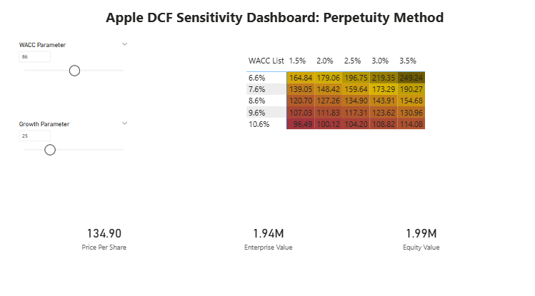
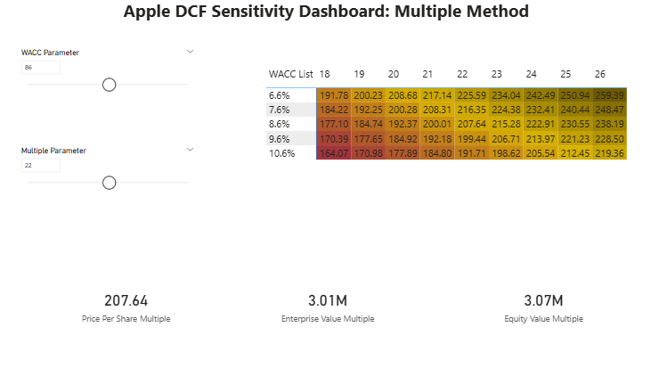

# Apple Inc. Intrinsic Valuation & Sensitivity Hub

**Built with Excel & Power BI | Integrated 3-Statement & DCF Modeling**

---

## 📋 Project Overview
This project provides a comprehensive valuation of **Apple Inc. (AAPL)**, bridging the gap between traditional 3-statement financial modeling and modern data visualization. As an aspiring Financial Analyst, my goal was to move beyond static spreadsheets and build a dynamic tool that allows stakeholders to visualize how shifting macroeconomic assumptions—like WACC and Terminal Growth—impact equity value in real-time.

## 🎯 The Objective
To create a "decision-support tool" rather than just a calculation. This hub allows users to stress-test financial assumptions and see the immediate impact on Apple’s implied share price through an interactive bridge between Excel and Power BI.

## 📉 The Investment Thesis: (33.9%) Downside
My analysis indicates that Apple is currently trading at a significant premium to its fundamental value. By blending both DCF methods, I arrived at a target price that represents a **33.9% downside** from the current market price of **$258.87**. While Apple remains a cash-flow powerhouse, the current market valuation requires aggressive growth assumptions that exceed conservative long-term projections.

---

## ⚙️ Financial Modeling Methodology
The foundation of this project is a bottom-up, integrated **3-statement model** (Income Statement, Balance Sheet, and Cash Flow Statement) for a 5-year forecast period (2026–2030).

* **DCF Triangulation:** Utilized a dual-method Discounted Cash Flow (DCF) approach.
* **Perpetuity Growth Method:** Assumed a long-term $g$ of 2.5%.
* **Exit Multiple Method:** Utilized a 22.0x EBITDA multiple.
* **Cost of Capital:** A **WACC of 8.6%** was derived using the Capital Asset Pricing Model (CAPM).

## 🚀 Technical Innovation: The Excel-to-Power BI Bridge
To enhance usability, I developed a navigation hub within Excel using a **Relative Path formula**. 

* **One-Click Navigation:** A seamless bridge that launches a local Power BI Sensitivity Dashboard directly from the Excel Summary sheet.
* **DAX Integration:** The dashboard uses complex DAX measures to visualize thousands of valuation scenarios.
* **Portfolio Ready:** By utilizing relative paths, the project is fully portable; once downloaded, the interactive link recalibrates to the user's local directory automatically.

---

## ✅ Key Skills Demonstrated
* **Financial Analysis:** DCF Modeling, 3-Statement Integration, WACC derivation.
* **Business Intelligence:** Power BI (Power Query/DAX), Data Visualization.
* **Workflow Automation:** Cross-platform technical integration and "Stress-Testing" methodologies.
